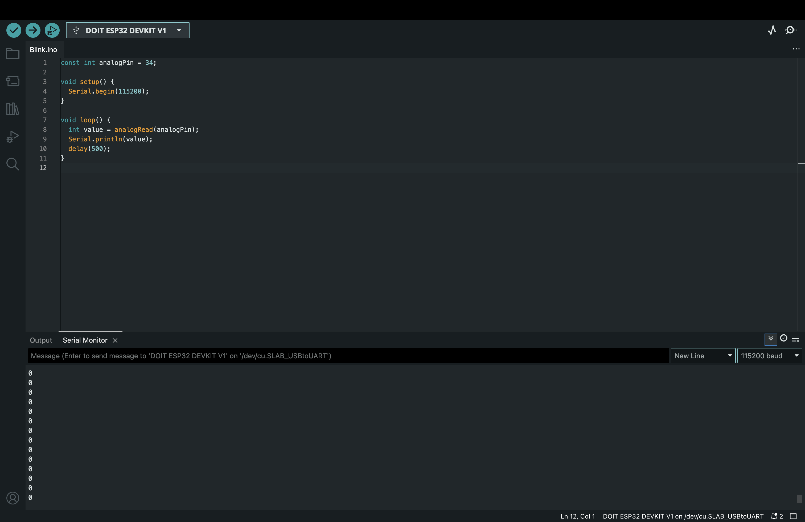

# IoT25-HW03

## ✅ Objective  
This assignment demonstrates how to read analog values from a potentiometer using the ESP32's built-in ADC (Analog-to-Digital Converter).  
The goal is to observe value changes through the Serial Monitor as the potentiometer is turned.

---

## Arduino IDE Configuration  
- **Board**: DOIT ESP32 DEVKIT V1  
- **Port**: /dev/cu.SLAB_USBtoUART



---

## Demonstration Video  
(https://youtube.com/shorts/R5cHmk4Ykco?si=HOqG5db18Kg5j3vZ)

---

## Hardware Setting
- **Potentiometer**  
  - Left pin: GND
  - Right pin: 3.3V
  - Middle pin: GPIO 34 (analog input)

---

## Code

```cpp
const int analogPin = 34;

void setup() {
  Serial.begin(115200);
}

void loop() {
  int value = analogRead(analogPin);
  Serial.println(value);
  delay(500);
}
